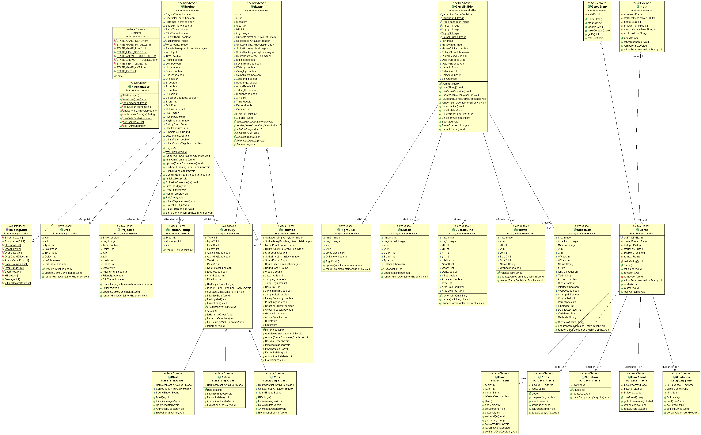

# OOP Education Game

> [2017SS] Object-Oriented Programming Class Team Project
 
- 본 프로젝트는 객체지향프로그래밍 팀프로젝트 Repository 입니다. (Java-based)
- 객체지향프로그래밍에서의 OOP 개념을 게임에 녹여만든 교육용 애플리케이션입니다.

## Authors
- 송연주
- 전지원
- 신희수
- 김명수
- Ilan Ajoulay
